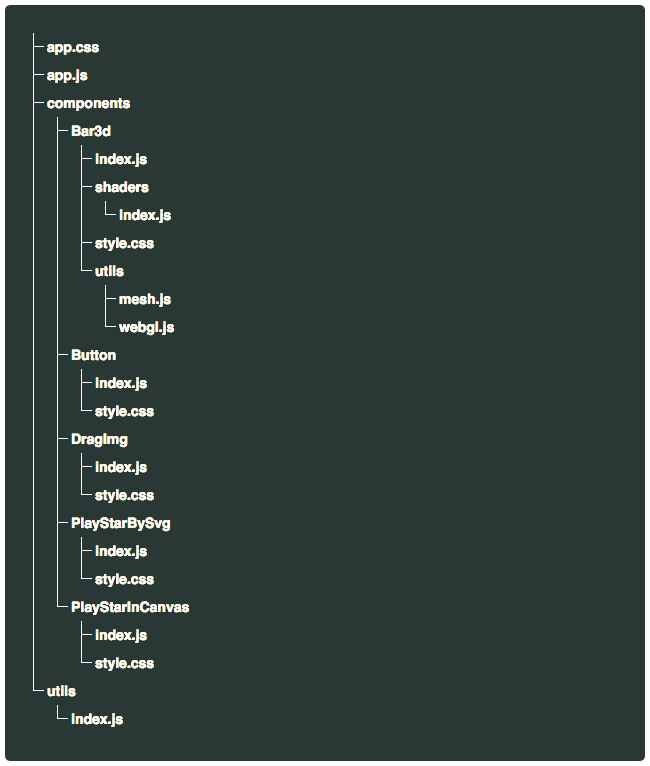

===

标题: [小清新] 一段 node 脚本生成风格优雅的 Directory Tree
标签: 前端,nodejs

===

## 一些烦恼

如果你常常在博客中插入一些文件目录结构，不免会有碰到诸如此类的问题：

* 使用图片输出的话，感官上不够和谐，尤其在移动端环境下，图片内容可能会被多次转码、缩放以至于影响阅读体验。
* 使用文本输出的话，在不同设备、编辑器下内容排版容易混乱。
* 某一天，你想修改一下内容或者结构时，一个字符一个字符的编辑简直让人抓狂。
* 使用文本输出的另一个毛病就是，不同设备、平台的字号、字体、字符样式都不一样。也许你写的时候觉得足够有美感，在受众的设备里却如同一坨翔。

## 解决方案

由于但不限于上述种种原因，自己写了一个小脚本，可以顺利地实现目录树的生成。结果被输出为html片段，通过附加CSS样式，效果远好于前几种的方式。

脚本输出的 html 长这样：

~~~html

  <ul class="tree"><li>app.css</li><li>app.js</li><li>components<ul><li>Bar3d<ul><li>index.js</li><li>shaders<ul><li>index.js</li></ul></li><li>style.css</li><li>utils<ul><li>mesh.js</li><li>webgl.js</li></ul></li></ul></li><li>Button<ul><li>index.js</li><li>style.css</li></ul></li><li>DragImg<ul><li>index.js</li><li>style.css</li></ul></li><li>PlayStarBySvg<ul><li>index.js</li><li>style.css</li></ul></li><li>PlayStarInCanvas<ul><li>index.js</li><li>style.css</li></ul></li></ul></li><li>utils<ul><li>index.js</li></ul></li></ul>

~~~

显示的效果长这样（清新脱俗的黑白配、肥而不腻的字形，要多优雅有多风骚）：

## 源码奉上

很简单的东西，这里直接直接献上代码吧。如果确实能给大家带来一丢丢的效率，我就很欣慰了，或者大家有什么更优雅而高效的东东，不妨留言给我安利安利。

~~~js
/*
** File:  `makeTree.js`
** Usage: `node makeTree.js ./`
*/

const fs = require('fs');
const path = require('path');

function makeHtml(dir) {
  const items = fs.readdirSync(dir).map(file => {
    let str = file;

    const filePath = path.join(dir, file);
    if (fs.lstatSync(filePath).isDirectory()) {
      str += makeHtml(filePath);
    }

    return `<li>${str}</li>`;
  });

  return `<ul>${items.join('')}</ul>`;
}

const dirToShow = process.argv[2] || './';
const treeStr = makeHtml(path.join(__dirname, dirToShow.trim()));

const containerName = 'parksben-is-just-one-single-doge';
const htmlStr = `

  <ul class="tree">${treeStr.slice(4)}

`;

fs.writeFileSync(path.join(__dirname, 'tree.html'), htmlStr, 'utf8');
console.log('==> Done: the directory tree is saved to ./tree.html');
~~~

## 局限性

这样做解决了一部分问题，至少往自己的博客文章里放问题不大。

但还有很大的局限性，比如对于掘金、简书、知乎这样的第三方页面，直接插 CSS 很难完全覆盖已有的样式，工作也很繁琐。

个人想到的另一个办法是把内容输出成 svg，这样，在保证样式和内容正确性的同时，读者也可以直接 copy 上面的文字。这个我打算下一步弄下，可行的话再把代码 push 出来。

## 后续

最后再废话一两句，最近有很多东西感觉可以分享出来，比如下一篇文章我准备写写 webGL 的一些内容，或者地图开发方面的内容。先在这里挖个坑，好逼迫一下自己。

好长一段时间没写文章了，加班、通宵什么的都不是借口，大好时光可不能就此荒废。
